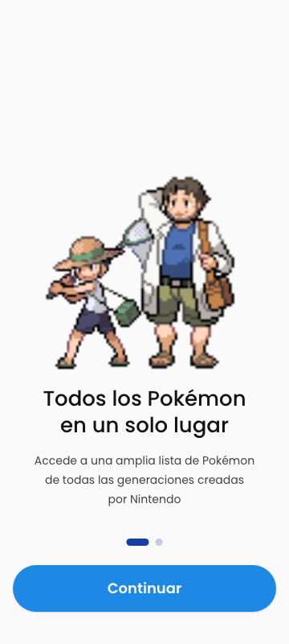
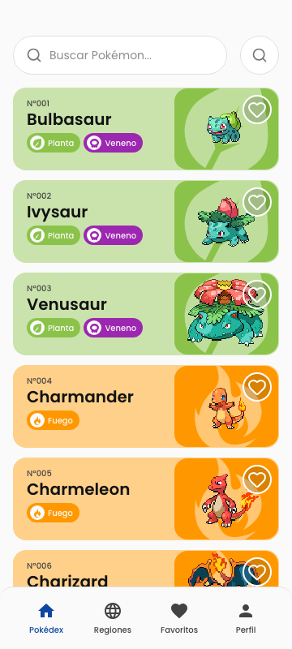
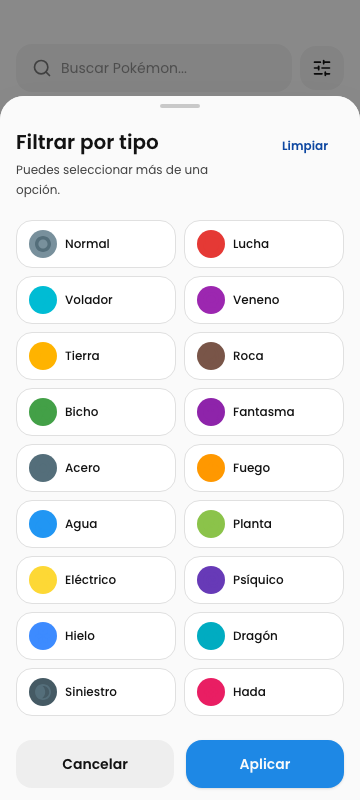
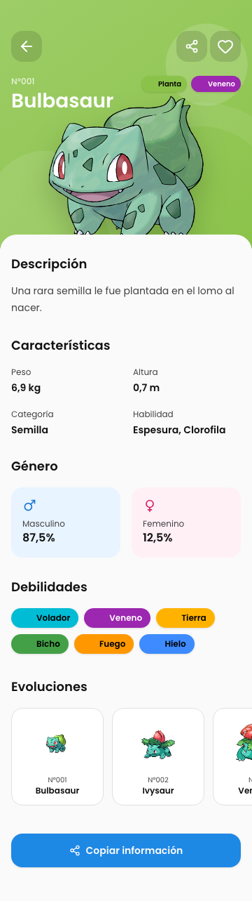
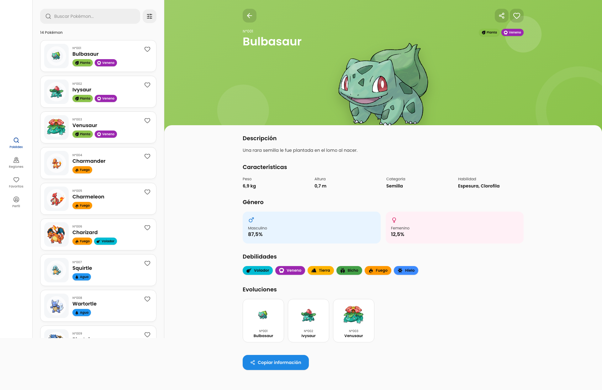

# Pokédex · Prueba Front End

Pokédex construida con Vue 3 a partir de un sistema visual diseñado para mobile y adaptado a una experiencia web completa. La solución prioriza datos reales, rendimiento con más de mil registros, consistencia visual, accesibilidad y una arquitectura fácil de mantener.

## Evidencia visual

Las imágenes son goldens reales de Playwright y forman parte de la regresión visual del proyecto.

| Onboarding                                                                                        | Catálogo                                                                                         | Filtros                                                                                        | Detalle                                                                                        |
| ------------------------------------------------------------------------------------------------- | ------------------------------------------------------------------------------------------------ | ---------------------------------------------------------------------------------------------- | ---------------------------------------------------------------------------------------------- |
|  |  |  |  |



En mobile se conserva el lenguaje y la geometría del diseño. En desktop, el catálogo aprovecha el ancho disponible sin escalar indefinidamente y el detalle adopta un patrón master-detail con listado y ficha de scroll independiente.

## Ejecutar rápidamente

Requisitos: Node.js 22+ y pnpm 10+.

```bash
corepack enable
pnpm install --frozen-lockfile
pnpm dev
```

Abrir `http://localhost:5173`.

## Requerimientos cubiertos

| Requerimiento                               | Implementación                                                                                    |
| ------------------------------------------- | ------------------------------------------------------------------------------------------------- |
| Vue.js como framework                       | Vue 3, Composition API, TypeScript estricto, Vite y Vue Router.                                   |
| Catálogo y detalle con datos de PokeAPI     | GraphQL para búsqueda/listado y REST para la ficha completa; todas las respuestas se validan.     |
| Loading inspirado en una Pokébola           | Pokébola construida y animada con CSS, con soporte para reducción de movimiento.                  |
| Compartir nombre y atributos                | Clipboard API con payload determinista y valores separados por comas.                             |
| Favoritos sin backend                       | Pinia y persistencia local versionada; eliminación, undo y rehidratación en lotes.                |
| UI fiel, responsive y basada en componentes | Tokens de Figma, Tailwind y primitives propios de estilo shadcn-vue.                              |
| Arquitectura y buenas prácticas             | Integración, dominio, estado y presentación separados; SRP, DRY y KISS aplicados al alcance real. |
| Pensar en gran cantidad de datos            | Paginación remota, infinite scroll, virtualización, caché y prevención de solicitudes N+1.        |
| Pruebas unitarias como valor adicional      | 63 unit tests, cobertura, E2E, accesibilidad y regresión visual.                                  |

### Funcionalidad entregada

- Onboarding de dos pasos; todas las rutas funcionales quedan protegidas hasta completarlo.
- Catálogo con búsqueda parcial por nombre, búsqueda por ID, filtro multi-tipo y conteo remoto.
- Infinite scroll, loading inicial y progresivo, recuperación de página y estados sin resultados.
- Ficha localizada con descripción, tipos, peso, altura, categoría, habilidades, género y debilidades.
- Favoritos persistentes, grilla compartida, swipe-to-delete, alternativa accesible y undo.
- Compartir información, navegación de retorno y favorito sincronizado entre catálogo y detalle.
- Estados de error/reintento, favoritos vacíos y secciones aún no disponibles.
- Animaciones de entrada, búsqueda, sheets, loaders, detalle y feedback de acciones.

## Tecnologías utilizadas

| Tecnología                   | Razón de la elección                                                                      |
| ---------------------------- | ----------------------------------------------------------------------------------------- |
| Vue 3 + Composition API      | Composición reactiva y componentes pequeños sin complejidad innecesaria.                  |
| TypeScript                   | Contratos estrictos entre API, dominio, stores y presentación.                            |
| Vite + Vue Router            | Desarrollo/build rápido y navegación con guards de onboarding.                            |
| Pinia                        | Estado predecible para catálogo, favoritos y preferencias; persistencia desacoplada.      |
| Tailwind CSS v4 + shadcn-vue | Tokens semánticos y primitives centralizados; CVA y Reka UI modelan variantes y estados.  |
| PokeAPI GraphQL + REST       | Consultas remotas eficientes para catálogo y riqueza de datos bajo demanda para la ficha. |
| Zod                          | Validación runtime de toda respuesta externa antes de entrar al dominio.                  |
| TanStack Vue Virtual         | Renderiza únicamente las filas visibles del catálogo.                                     |
| Vitest + Vue Test Utils      | Pruebas rápidas de dominio, stores y componentes del sistema.                             |
| Playwright + axe-core        | Flujos E2E, accesibilidad, geometría responsive y screenshots deterministas.              |
| GitHub Actions               | Formato, lint, tipos, cobertura, build y E2E como quality gate reproducible.              |

## Decisiones técnicas y de producto

### Datos preparados para escala

El listado REST de PokeAPI pagina resultados, pero no resuelve búsqueda parcial ni filtro por tipo en servidor. Descargar el índice completo y filtrarlo en el navegador habría sido suficiente para una demo, pero no representa una solución preparada para volumen. Por eso el catálogo usa GraphQL `v1beta2`:

- Cada página solicita 40 registros mediante `limit` y `offset`.
- Nombre, ID y tipos se convierten en un único `where` ejecutado por PokeAPI.
- Infinite scroll solicita la página siguiente cerca del final; no se descarga el índice completo.
- TanStack Virtual solo monta las filas visibles, aunque el store ya contenga varias páginas.
- Las URLs de sprite y artwork se derivan del ID recibido, evitando un detalle REST por card.
- Los favoritos se normalizan, deduplican y rehidratan por `_in` en lotes de hasta 100.
- La caché conserva consultas durante 30 minutos y recursos estáticos durante 24 horas.
- Las solicitudes concurrentes idénticas se deduplican; una versión de búsqueda descarta respuestas obsoletas.

REST queda reservado para la ficha seleccionada. El detalle compone `/pokemon`, `/pokemon-species`, `/type` y `/ability` porque los datos visibles no existen en un único recurso. No se consulta la cadena evolutiva: no forma parte de la interfaz final y añadirla produciría solicitudes sin valor funcional.

### Fuente visual y fuente de datos

Los requerimientos definen el comportamiento, Figma define la geometría y el sistema visual, y PokeAPI es la fuente de verdad del contenido. Cuando un mockup contiene un ID, tipo o conteo inconsistente, se conserva el diseño pero se muestra el dato real.

La tipografía se normalizó en Poppins. Los chips de los 18 tipos respetan la matriz de color de Figma, incluidos texto, icono y superficie. Mobile utiliza el sprite animado `generation-v/black-white` identificado en el diseño; desktop prioriza `official-artwork`, cuya resolución permite una composición más amplia sin pixelación.

### Alcance funcional deliberado

- Favoritos y onboarding se guardan en `localStorage` con un número de versión para permitir migraciones.
- Compartir se ubica en desktop para cumplir la funcionalidad sin alterar el frame mobile.
- El onboarding persiste una preferencia, pero no simula autenticación ni registro inexistentes.
- Regiones y Perfil muestran un estado explícito en lugar de inventar contenido.
- No se añadió backend, base de datos, dark mode o despliegue porque no aportaban valor al alcance evaluado.
- Fallas de red muestran error y reintento; no se reemplazan datos reales con mocks productivos.

## Arquitectura

La aplicación separa integración, dominio, estado y presentación para impedir que el contrato HTTP de PokeAPI se filtre hacia las vistas.

```text
PokeAPI GraphQL + REST
        ↓
Zod + caché + deduplicación
        ↓
PokemonRepository
        ↓
modelos de dominio normalizados
        ↓
Pinia
        ↓
views y componentes de feature
        ↓
primitives shadcn + tokens Tailwind
```

- `src/features/pokemon/api`: schemas, red, caché TTL, solicitudes en vuelo y composición de endpoints.
- `src/features/pokemon/domain`: modelos independientes de Vue, metadatos visuales y formatters puros.
- `src/stores`: catálogo remoto, favoritos con undo y preferencias persistidas.
- `src/components/ui`: única capa de controles interactivos y variantes de diseño.
- `src/components/{catalog,pokemon,favorites,states}`: componentes de feature sin conocimiento del JSON externo.
- `src/views`: composición de rutas y adaptación responsive.

`PokemonRepository` encapsula GraphQL/REST detrás de una interfaz y transforma respuestas validadas en modelos del proyecto. Pinia coordina estado e interacción, pero no contiene lógica HTTP. Esta separación aplica responsabilidad única y DRY sin introducir una capa genérica de casos de uso que, para este alcance, violaría KISS.

## Sistema de diseño

`src/styles/main.css` es la fuente de verdad de superficies, texto, acciones, tipos Pokémon, bordes, radios, sombras, motion y límites de layout. `@theme inline` expone esos tokens a Tailwind; las vistas no mantienen una segunda paleta.

Los controles se implementan como componentes propios siguiendo la filosofía shadcn-vue: el código vive en el repositorio y puede adaptarse al sistema visual. Entre los primitives se encuentran `Button`, `SearchField`, `Input`, `Checkbox`, `Toggle`, `Link`, `Sheet`, `Card`, `Badge`, `Skeleton`, `SkipLink` y `Sonner`.

HTML semántico de contenido y layout permanece permitido, pero ESLint bloquea controles nativos (`button`, `input`, `select`, `textarea`, `a`, `label`) fuera de `components/ui`. También impide imports directos de `RouterLink` y `vue-sonner`. De esta manera foco, loading, variantes, estados y tokens atraviesan siempre la misma capa.

La firma visual es la card bicolor por tipo: contenido sobre una superficie tintada y sprite sobre un panel saturado con un emblema elemental. El resto de la interfaz se mantiene deliberadamente neutro; no se añadieron gradientes, glassmorphism o estadísticas decorativas ajenas al producto.

## Adaptación responsive

- `360×800`: composición mobile, navegación inferior fija y sheets desde el borde inferior.
- `768×1024`: catálogo virtualizado de dos columnas con línea de lectura controlada.
- `≥1024 px`: rail lateral de 104 px, shell al 100% del viewport y catálogo adaptativo.
- El catálogo alcanza hasta cinco columnas dentro de un máximo de 1584 px para no perder relación visual en ultrawide.
- Al seleccionar un Pokémon, el listado conserva 420 px y la ficha se centra en un máximo de 1120 px.
- Catálogo y ficha tienen scroll independiente; seleccionar otra especie reinicia únicamente la ficha.
- Mobile reserva el espacio de la navegación fija para que debilidades y últimas cards nunca queden ocultas.

El diseño desktop no escala una pantalla mobile para llenar el monitor. Reorganiza la misma jerarquía en un patrón web reconocible y mantiene tokens, radios, densidad, controles y estados.

## Uso de IA en el desarrollo

El proyecto se desarrolló con asistencia de **Codex usando GPT-5.6 Sol**, ajustando el nivel de esfuerzo de razonamiento según la complejidad de cada tarea. La IA se utilizó como herramienta de ingeniería para acelerar análisis, implementación, pruebas y documentación; la definición del producto, los recursos disponibles, las restricciones y la aceptación final permanecieron bajo criterio humano.

### Flujo de trabajo

1. **Especificación humana:** se proporcionaron los requerimientos funcionales, el diseño, la documentación de la prueba, el stack obligatorio y los criterios de calidad esperados.
2. **Plan mode:** al inicio se usó este modo para extraer y organizar requerimientos, detectar inconsistencias, definir tecnologías, establecer la arquitectura y dividir la implementación en entregables verificables.
3. **Goal mode:** una vez definido un criterio de éxito claro, se utilizó un objetivo persistente para mantener la ejecución orientada al resultado completo y no únicamente a tareas aisladas.
4. **Implementación asistida:** Codex inspeccionó el repositorio, modificó componentes, ejecutó herramientas, añadió pruebas, comparó capturas y creó commits trazables. El nivel de esfuerzo se aumentó para decisiones de arquitectura, integración de datos y revisiones visuales, y se redujo para cambios mecánicos o validaciones directas.
5. **Revisión iterativa:** cada incremento pasó por revisión humana, validación automática y una nueva inspección con IA. Los hallazgos se incorporaron al siguiente ciclo hasta cumplir los criterios funcionales, visuales y técnicos.

### Iteraciones relevantes

El primer resultado no se consideró la entrega final. La revisión conjunta permitió encontrar y corregir, entre otros, los siguientes puntos:

- La paginación y búsqueda inicialmente necesitaban una estrategia realmente remota; se reemplazó el filtrado local por consultas GraphQL paginadas, infinite scroll y virtualización.
- La obtención de sprites se optimizó para evitar solicitudes de detalle por cada card y se diferenciaron los assets apropiados para mobile y desktop.
- Se ajustaron tamaños de imágenes, iconos de tipos, contraste de badges, tipografía, radios, sombras, transparencias y espaciados pequeños.
- Se corrigieron el ancho útil en desktop, el máximo de lectura, la grilla de favoritos y el scroll independiente del catálogo y el detalle.
- Se unificaron controles mediante primitives shadcn, incluyendo favorito, búsqueda, filtros, sheets, botones y estados de loading.
- Se añadieron navegación fija mobile, animaciones, error/reintento, guard de onboarding, accesibilidad y pruebas de regresión para impedir que los ajustes se perdieran.

Este proceso combinó dos responsabilidades complementarias: la persona definió qué debía construirse, aportó los recursos, revisó el comportamiento real y señaló desviaciones; la IA aceleró la exploración técnica, la implementación y la verificación repetible. El resultado surgió de un ciclo continuo de **especificación humana → desarrollo asistido → pruebas → revisión humana y con IA → corrección**, manteniendo la decisión final y la responsabilidad sobre la entrega en el lado humano.

## Calidad, accesibilidad y pruebas

```bash
pnpm check            # formato, lint, tipos, cobertura y build
pnpm test:unit        # 63 pruebas unitarias
pnpm test:e2e         # flujos, axe y regresión visual
pnpm test:e2e:update  # actualiza goldens solo ante cambios visuales intencionales
```

- Cobertura actual: 99,39% statements, 100% lines/functions y 92,45% branches.
- Umbral de CI: 80% lines/functions/statements y 75% branches sobre dominio y stores.
- Playwright ejecuta una matriz de `360×800`, `768×1024`, `1440×900` y `1920×1080`.
- Los fixtures deterministas viven únicamente en tests; producción siempre consume PokeAPI real.
- Axe bloquea violaciones críticas o serias en onboarding, catálogo, detalle y estados principales.
- Foco visible, skip link, nombres accesibles, targets táctiles y `prefers-reduced-motion` están cubiertos.
- Las medidas críticas de shell, catálogo, artwork, footer fijo y tipografía se validan con aserciones geométricas.
- GitHub Actions ejecuta `pnpm check`, instala Chromium y corre la suite E2E en cada push a `main` o pull request.

## Estructura del repositorio

```text
src/
├── components/          # primitives shadcn y componentes de feature
├── features/pokemon/    # API, schemas Zod, dominio y formatters
├── layouts/             # shell responsive
├── router/              # rutas y guards de onboarding
├── stores/              # catálogo, favoritos y preferencias
├── styles/              # tokens Figma + Tailwind
└── views/               # pantallas y composición responsive
tests/
├── unit/                # dominio, stores y primitives
└── e2e/                 # flujos, accesibilidad y screenshots
```

Pokémon, PokeAPI y sus assets pertenecen a sus respectivos propietarios y se utilizan únicamente para esta prueba técnica.
