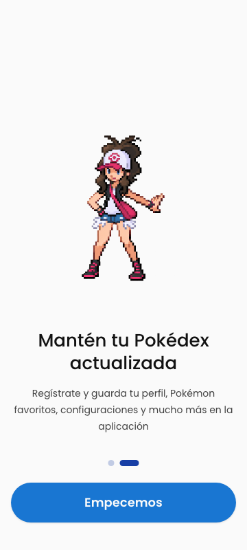
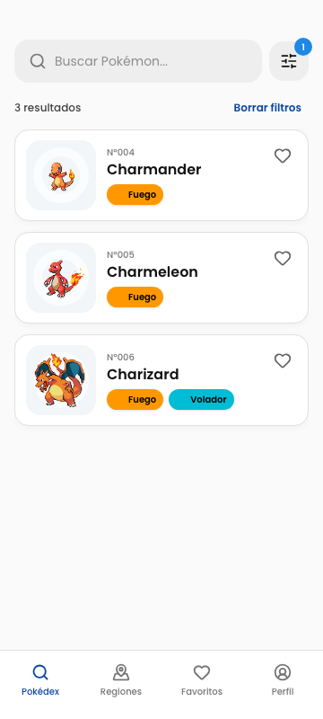
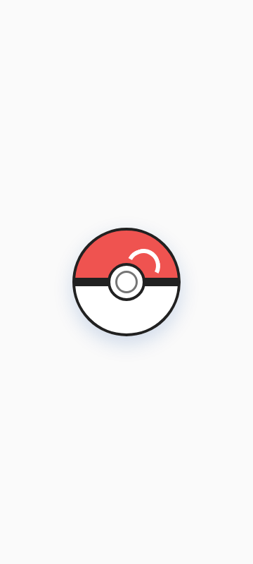
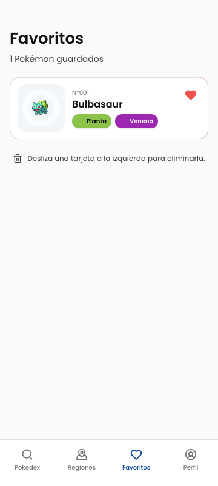
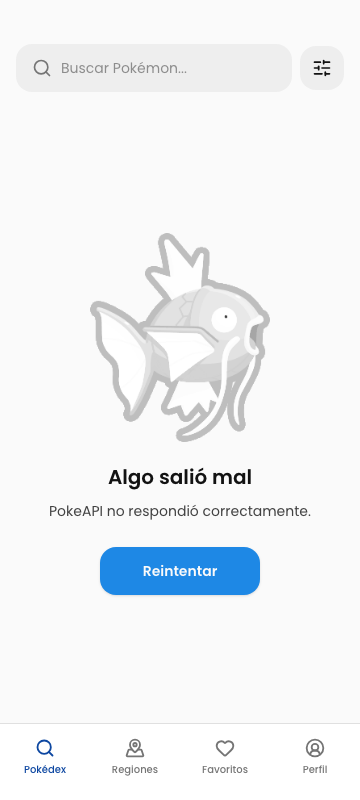
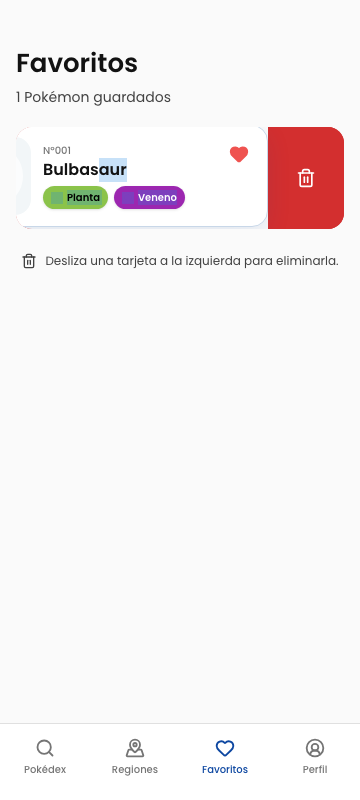
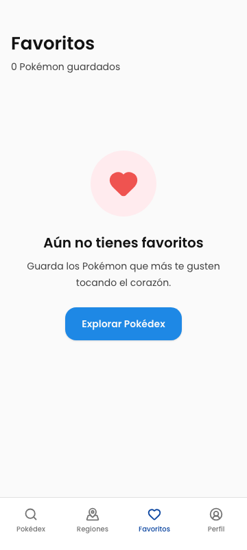
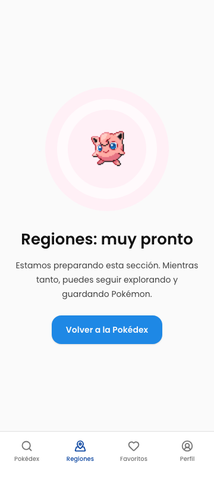
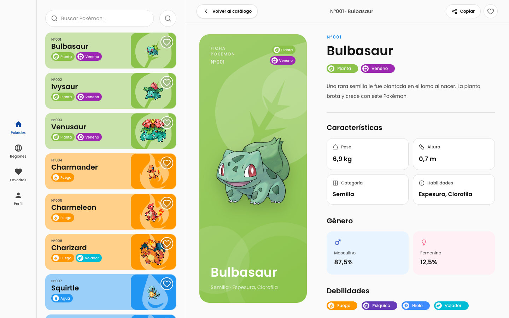

# Pokédex · Prueba Front End

Una implementación Vue 3 de la prueba técnica, construida desde el draft móvil de Figma y adaptada a una experiencia master-detail para desktop. La prioridad fue entregar producto, no solo pantallas: PokeAPI real, arquitectura tipada, favoritos persistentes, accesibilidad, pruebas y evidencia visual reproducible.

[Figma editable](https://www.figma.com/design/4Uh3KoeuzsYusZ90pa4l1M/Pok%C3%A9dex--Copy-?node-id=0-1&p=f) · [Trazabilidad completa](docs/requirements.md) · [Decisiones](docs/decisions.md)

## Recorrido visual

| Onboarding                                                                                          | Catálogo                                                                                            | Filtros                                                                                                 |
| --------------------------------------------------------------------------------------------------- | --------------------------------------------------------------------------------------------------- | ------------------------------------------------------------------------------------------------------- |
|  |     |  |
|  |  |  |

| Detalle                                                                                                              | Favoritos                                                                                                 | Estados                                                                                                       |
| -------------------------------------------------------------------------------------------------------------------- | --------------------------------------------------------------------------------------------------------- | ------------------------------------------------------------------------------------------------------------- |
|                  |               |               |
|  |  |  |

### Adaptación web



La misma suite también congela el catálogo y el detalle en `768×1024`; las imágenes viven en `tests/e2e/__screenshots__/tablet-768`.

## Qué está implementado

- Onboarding de dos pasos y splash Pokébola animado con CSS.
- Catálogo completo de PokeAPI, búsqueda por nombre/ID y filtro multi-tipo.
- Virtualización, hidratación visible, concurrencia acotada, caché TTL y deduplicación.
- Detalle localizado: descripción, tipos, medidas, categoría, habilidades, género, debilidades y evoluciones.
- Clipboard con nombre y todos los atributos visibles separados por comas.
- Favoritos Pinia persistidos, swipe-to-delete, botón accesible y undo.
- Error/retry, búsqueda vacía, favoritos vacíos y secciones “muy pronto”.
- Mobile pixel-matched, tablet en dos columnas y desktop master-detail.
- Reducción de movimiento, navegación semántica y auditoría axe.

La [matriz de requisitos](docs/requirements.md) enlaza cada condición del correo, PDF y Figma con su evidencia de aceptación.

## Stack

- Vue 3, TypeScript estricto, Vite y Vue Router.
- Pinia con persistencia local versionada.
- Tailwind CSS v4 y tokens semánticos derivados de Figma.
- Primitives shadcn-vue centralizados, CVA, Reka UI y Lucide.
- Zod en el borde de PokeAPI.
- TanStack Vue Virtual para el catálogo.
- Vitest, Vue Test Utils, Playwright y axe-core.

Más detalle en [arquitectura](docs/architecture.md) y [sistema de diseño](docs/design-system.md).

## Ejecutar localmente

Requisitos: Node.js 22+ (CI usa 24) y pnpm 10+.

```bash
corepack enable
pnpm install --frozen-lockfile
pnpm dev
```

La app queda disponible en `http://localhost:5173`.

## Calidad

```bash
pnpm check            # formato, lint, tipos, cobertura y build
pnpm test:e2e         # 360×800, 768×1024 y 1440×900
pnpm test:e2e:update  # actualiza goldens solo ante un cambio visual intencional
```

La cobertura mínima exigida en CI es 80% de líneas/funciones/statements y 75% de ramas sobre dominio y stores. La ejecución actual alcanza 100% de líneas/funciones y 92% de ramas. Playwright valida flujos con un contrato PokeAPI determinista; la app productiva nunca usa esos fixtures.

El workflow de GitHub Actions ejecuta formato, ESLint sin warnings, `vue-tsc`, cobertura, build, E2E, axe y comparación de screenshots.

## Estructura

```text
src/
├── components/          # UI primitives shadcn y componentes de feature
├── features/pokemon/    # API, schemas Zod, dominio y formatters
├── layouts/             # shell responsive
├── router/              # rutas y guards de onboarding
├── stores/              # Pinia: catálogo, favoritos y preferencias
├── styles/              # tokens Figma + Tailwind
└── views/               # pantallas y composición responsive
tests/
├── unit/                # dominio, filtros, stores y persistencia
└── e2e/                 # flujos, accesibilidad y regresión visual
```

## Notas de entrega

- No hay backend ni base de datos.
- No hay despliegue por decisión de alcance; el repositorio y CI son la entrega solicitada.
- Pokémon y sprites pertenecen a sus respectivos propietarios. PokeAPI y sus assets se consumen únicamente para esta prueba técnica.
